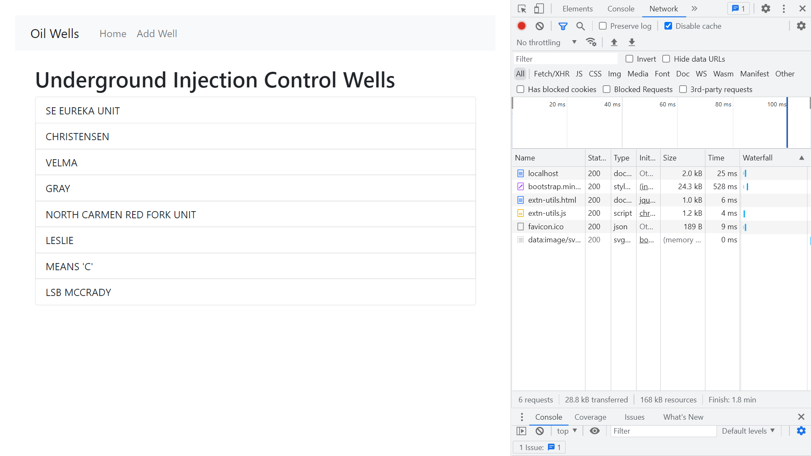

# :zap: Node Koa Data

* Node.js + Koa used with embedded javascript (EJS) to display list of oil well data
* **Note:** to open web links in a new window use: _ctrl+click on link_


## :page_facing_up: Table of contents

* [:zap: Node Koa Data](#zap-node-koa-data)
  * [:page_facing_up: Table of contents](#page_facing_up-table-of-contents)
  * [:books: General info](#books-general-info)
  * [:camera: Screenshots](#camera-screenshots)
  * [:signal_strength: Technologies](#signal_strength-technologies)
  * [:floppy_disk: Setup](#floppy_disk-setup)
  * [:wrench: Testing](#wrench-testing)
  * [:computer: Code Examples](#computer-code-examples)
  * [:cool: Features](#cool-features)
  * [:clipboard: Status, Testing & To-Do List](#clipboard-status-testing--to-do-list)
  * [:clap: Inspiration](#clap-inspiration)
  * [:file_folder: License](#file_folder-license)
  * [:envelope: Contact](#envelope-contact)

## :books: General info

* Koa middleware used to add routing, body-parser, JSON and EJS HTML views
* Simple Bootstrap navbar
* An oil well name can be added to the list - this is not stored in a database and will be lost when app is shut down.

## :camera: Screenshots



## :signal_strength: Technologies

* [Node.js v16](https://nodejs.org/) Javascript runtime using the [Chrome V8 engine](https://v8.dev/)
* [koa v2](https://www.npmjs.com/package/koa) HTTP middleware alternative to Express.js
* [koa-ejs v4](https://www.npmjs.com/package/koa-ejs) embedded javascript
* [Bootstrap v5](https://getbootstrap.com) responsive navbar and styling

## :floppy_disk: Setup

* `npm i` to install dependencies
* `npm run dev` runs app in the development mode with auto-restart.
* Open [http://localhost:5000](http://localhost:5000) to view in the browser.

## :wrench: Testing

* N/A

## :computer: Code Examples

* `index.js` asynchronous function to render the index page in the browser root using Koa middleware

```javascript
router.get("/", async (ctx) => {
  await ctx.render("index", {
    title: "Underground Injection Control Wells ",
    wells: wells,
  });
});
```

## :cool: Features

* Uses Koa instead of the usual Express middleware

## :clipboard: Status, Testing & To-Do List

* Status: Working
* To-Do: Add well update and delete + database connection & other db fields such as location of well etc.

## :clap: Inspiration

* tba

## :file_folder: License

* This project is licensed under the terms of the MIT license.

## :envelope: Contact

* Repo created by [ABateman](https://github.com/AndrewJBateman), email: gomezbateman@yahoo.com
